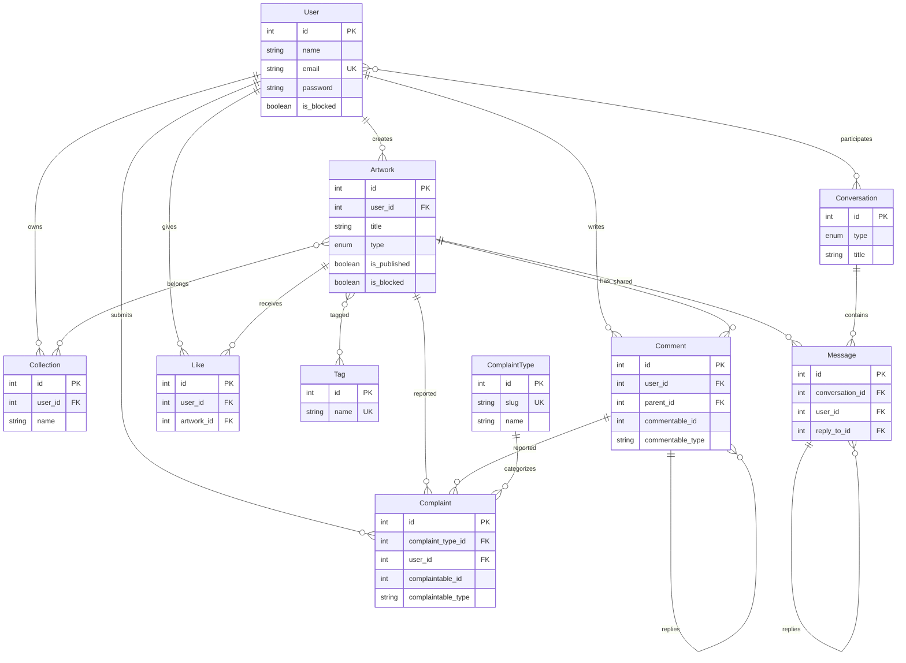

# Диаграмма 2: M1 - Концептуальная модель предметной области (ER-диаграмма)

Скопируйте код ниже и вставьте в [Mermaid Live Editor](https://mermaid.live/)

```mermaid
erDiagram
    User ||--o{ Artwork : creates
    User ||--o{ Collection : owns
    User ||--o{ Comment : writes
    User ||--o{ Like : gives
    User }o--o{ Conversation : participates
    User ||--o{ Complaint : submits
    Artwork }o--o{ Tag : tagged
    Artwork }o--o{ Collection : belongs
    Artwork ||--o{ Comment : has
    Artwork ||--o{ Like : receives
    Artwork ||--o{ Complaint : reported
    Artwork ||--o{ Message : shared
    Comment ||--o{ Comment : replies
    Comment ||--o{ Complaint : reported
    Conversation ||--o{ Message : contains
    Message ||--o{ Message : replies
    ComplaintType ||--o{ Complaint : categorizes
    User {
        int id PK
        string name
        string email UK
        string password
        boolean is_blocked
    }
    Artwork {
        int id PK
        int user_id FK
        string title
        enum type
        boolean is_published
        boolean is_blocked
    }
    Collection {
        int id PK
        int user_id FK
        string name
    }
    Tag {
        int id PK
        string name UK
    }
    Comment {
        int id PK
        int user_id FK
        int parent_id FK
        int commentable_id
        string commentable_type
    }
    Like {
        int id PK
        int user_id FK
        int artwork_id FK
    }
    Conversation {
        int id PK
        enum type
        string title
    }
    Message {
        int id PK
        int conversation_id FK
        int user_id FK
        int reply_to_id FK
    }
    Complaint {
        int id PK
        int complaint_type_id FK
        int user_id FK
        int complaintable_id
        string complaintable_type
    }
    ComplaintType {
        int id PK
        string slug UK
        string name
    }
```

