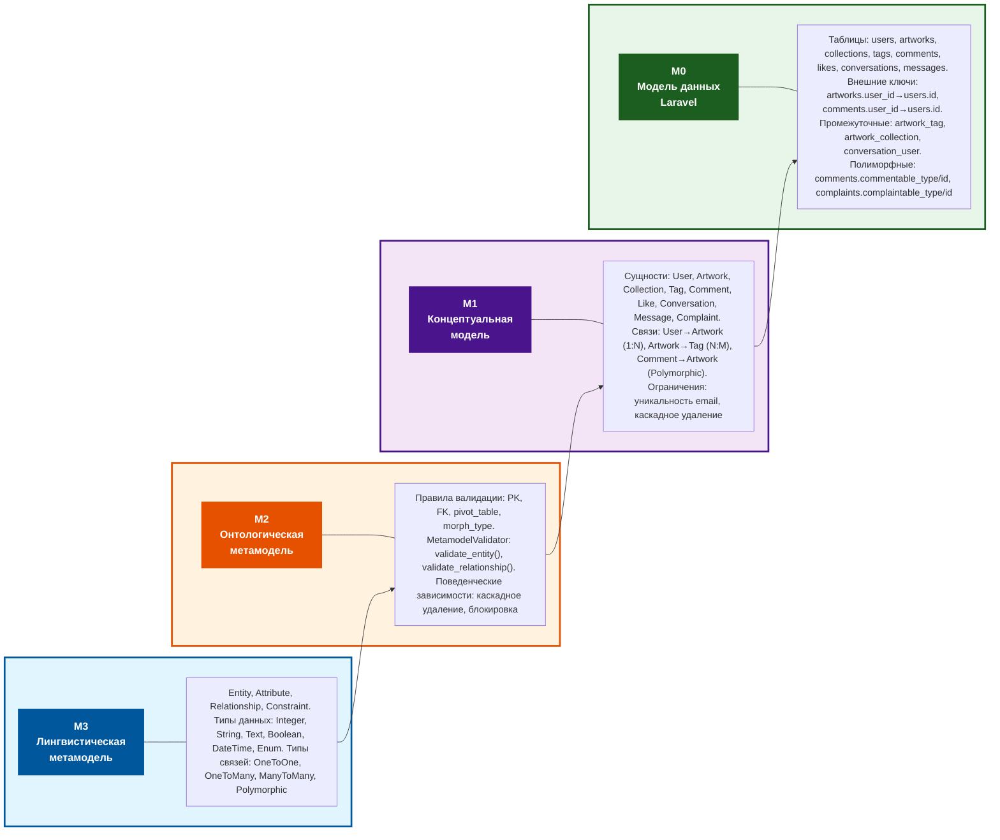

# Диаграмма 1: Четырехуровневая иерархия моделей (M3-M0)

Скопируйте код ниже и вставьте в [Mermaid Live Editor](https://mermaid.live/)

## Описание структуры диаграммы

Диаграмма показывает четырехуровневую иерархию моделей, расположенную слева направо. Каждый уровень представлен цветным блоком с названием модели слева и её содержимым справа.

**M3 (синий блок)** — определяет базовые элементы языка моделирования: Entity, Attribute, Relationship, Constraint, а также типы данных и связей. Стрелка ведет от M3 к M2, показывая, что элементы M3 используются для построения правил M2.

**M2 (оранжевый блок)** — содержит правила валидации (PK, FK, pivot_table, morph_type), класс MetamodelValidator с методами проверки и поведенческие зависимости. Стрелка от M2 к M1 показывает применение этих правил к концептуальной модели.

**M1 (фиолетовый блок)** — описывает конкретную предметную область Library Stroll: сущности (User, Artwork, Collection и др.), связи между ними (User→Artwork, Artwork→Tag) и ограничения целостности. Стрелка от M1 к M0 показывает преобразование концептуальной модели в физическую реализацию.

**M0 (зеленый блок)** — содержит физическую реализацию: таблицы БД (users, artworks и др.), внешние ключи, промежуточные таблицы для ManyToMany связей и полиморфные связи через пары колонок.

Стрелки между уровнями показывают направление преобразования: от абстрактных элементов языка (M3) через правила валидации (M2) к конкретной модели предметной области (M1) и её физической реализации (M0).

