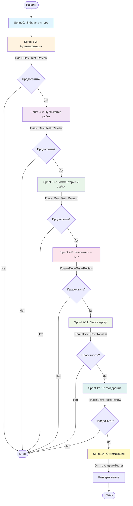

# Диаграмма активностей - Agile модель

## Описание

Диаграмма показывает итеративный процесс Agile/Scrum с короткими спринтами для проекта Library Stroll.

## Диаграмма (Mermaid)

## Легенда

- **Разные цвета блоков:** Разные спринты
- **Красные блоки (Daily Standups):** Ежедневные встречи команды
- **Стрелки с "Продолжить?":** Решение о продолжении разработки

## Структура каждого спринта

Каждый спринт (2 недели) включает:

1. **Sprint Planning** — планирование задач на спринт
2. **Daily Standups** — ежедневные 15-минутные встречи
3. **Backlog** — список задач для выполнения
4. **Разработка** — параллельная работа Backend и Frontend
5. **Тестирование** — непрерывное тестирование
6. **Sprint Review** — демонстрация результатов заказчику
7. **Sprint Retrospective** — анализ и улучшение процесса

## Особенности Agile

- Короткие итерации (2 недели)
- Непрерывная обратная связь
- Гибкость к изменениям требований
- Высокая прозрачность процесса
- Возможность остановки на любом спринте

