# Диаграмма компонентов - Agile модель

## Описание

Диаграмма показывает архитектуру компонентов системы Library Stroll в Agile модели. Компоненты разрабатываются в коротких спринтах с непрерывной интеграцией.

## Диаграмма (Mermaid)

```mermaid
graph TB
    subgraph S1["Sprint 1-2: Auth"]
        A1[Auth + Profile]
        U1[User Service]
    end
    
    subgraph S2["Sprint 3-4: Artworks"]
        A2[Artwork + Upload]
        U2[Artwork + Media Service]
    end
    
    subgraph S3["Sprint 5-6: Comments"]
        A3[Comment + Like]
        U3[Comment + Notification Service]
    end
    
    subgraph S4["Sprint 7-8: Collections"]
        A4[Collection + Tag + Search]
        U4[Collection Service]
    end
    
    subgraph S5["Sprint 9-11: Messenger"]
        A5[Messenger + Chat]
        U5[Realtime + Attachment Service]
    end
    
    subgraph S6["Sprint 12-13: Moderation"]
        A6[Complaint + Moderation + Admin]
        U6[Moderation Service]
    end
    
    subgraph Core["Core"]
        Laravel[Laravel]
        Vue[Vue.js]
        DB[(DB)]
        Cache[(Cache)]
    end
    
    subgraph Infra["Infrastructure"]
        CI_CD[CI/CD]
        Pusher[Pusher]
        Queue[Queue]
    end
    
    A1 --> Vue
    A2 --> Vue
    A3 --> Vue
    A4 --> Vue
    A5 --> Vue
    A6 --> Vue
    
    U1 --> Laravel
    U2 --> Laravel
    U3 --> Laravel
    U4 --> Laravel
    U5 --> Laravel
    U6 --> Laravel
    
    U3 --> Pusher
    U5 --> Pusher
    
    Laravel --> DB
    Laravel --> Cache
    Laravel --> Queue
    
    CI_CD --> Laravel
    
    style S1 fill:#e1f5ff
    style S2 fill:#fff3e0
    style S3 fill:#f3e5f5
    style S4 fill:#e8f5e9
    style S5 fill:#fce4ec
    style S6 fill:#f1f8e9
    style Core fill:#fff9c4
    style Infra fill:#e0f2f1
```

## Особенности архитектуры в Agile

- **Микросервисная структура** — компоненты разрабатываются независимо
- **Непрерывная интеграция** — компоненты интегрируются после каждого спринта
- **Быстрая обратная связь** — изменения вносятся быстро
- **Автоматизация** — CI/CD для быстрого развертывания

