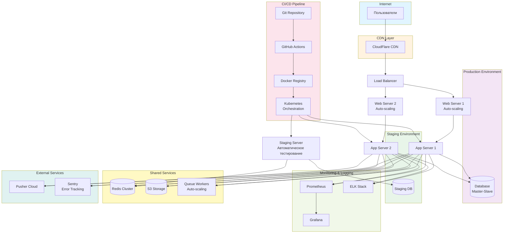

# Диаграмма развертывания - Agile модель

## Описание

Диаграмма показывает физическую архитектуру развертывания системы Library Stroll в Agile модели. Развертывание происходит автоматически после каждого спринта через CI/CD.

## Диаграмма (Mermaid)

## Особенности развертывания в Agile

- **Автоматическое развертывание** — через CI/CD pipeline
- **Контейнеризация** — Docker и Kubernetes для масштабирования
- **Auto-scaling** — автоматическое масштабирование под нагрузкой
- **Непрерывный мониторинг** — Prometheus, Grafana, ELK
- **Быстрые релизы** — развертывание после каждого спринта

