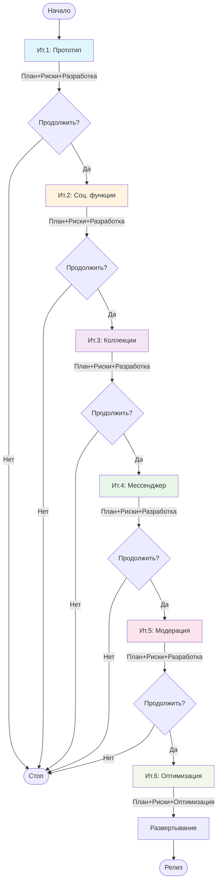

# Диаграмма активностей - Spiral модель

## Описание

Диаграмма показывает итеративный процесс спиральной модели с фокусом на управлении рисками для проекта Library Stroll.

## Диаграмма (Mermaid)

## Легенда

- **Синий блок:** Итерация 1 (Прототип)
- **Оранжевый блок:** Итерация 2 (Социальные функции)
- **Фиолетовый блок:** Итерация 3 (Коллекции и теги)
- **Зеленый блок:** Итерация 4 (Мессенджер)
- **Розовый блок:** Итерация 5 (Модерация)
- **Светло-зеленый блок:** Итерация 6 (Оптимизация и релиз)
- **Красные блоки:** Анализ рисков (ключевой процесс спиральной модели)

## Структура каждой итерации

Каждая итерация включает 4 квадранта спирали:

1. **Планирование** — определение целей и ограничений
2. **Анализ рисков** — идентификация и оценка рисков
3. **Разработка и тестирование** — создание и проверка функциональности
4. **Оценка** — анализ результатов и планирование следующей итерации

## Особенности Spiral

- Итеративный подход с фокусом на риски
- Возможность остановки проекта на любой итерации
- Раннее обнаружение проблем через прототипирование
- Гибкость в планировании следующих итераций

