# Диаграмма компонентов - Spiral модель

## Описание

Диаграмма показывает архитектуру компонентов системы Library Stroll в спиральной модели. Компоненты разрабатываются итеративно с фокусом на управление рисками.

## Диаграмма (Mermaid)

```mermaid
graph TB
    subgraph Iter1["Итерация 1: Прототип"]
        ProtoFrontend[Прототип Frontend]
        ProtoBackend[Прототип Backend]
        ProtoAuth[Базовая аутентификация]
    end
    
    subgraph Iter2["Итерация 2: Социальные функции"]
        CommentModule[Модуль комментариев]
        LikeModule[Модуль лайков]
        NotificationModule[Модуль уведомлений]
    end
    
    subgraph Iter3["Итерация 3: Коллекции и теги"]
        CollectionModule[Модуль коллекций]
        TagModule[Модуль тегов]
        SearchModule[Модуль поиска]
    end
    
    subgraph Iter4["Итерация 4: Мессенджер"]
        MessengerModule[Модуль мессенджера]
        RealtimeModule[Real-time модуль]
        AttachmentModule[Модуль вложений]
    end
    
    subgraph Iter5["Итерация 5: Модерация"]
        ComplaintModule[Модуль жалоб]
        ModerationPanel[Панель модератора]
        AdminPanel[Админ-панель]
    end
    
    subgraph Core["Ядро системы"]
        LaravelCore[Laravel Core]
        Database[(База данных)]
        Cache[(Кэш)]
    end
    
    subgraph External["Внешние сервисы"]
        Pusher[Pusher]
        Queue[Queue]
    end
    
    ProtoFrontend --> LaravelCore
    ProtoBackend --> LaravelCore
    ProtoAuth --> LaravelCore
    
    CommentModule --> LaravelCore
    LikeModule --> LaravelCore
    NotificationModule --> Pusher
    
    CollectionModule --> LaravelCore
    TagModule --> LaravelCore
    SearchModule --> LaravelCore
    
    MessengerModule --> LaravelCore
    RealtimeModule --> Pusher
    AttachmentModule --> LaravelCore
    
    ComplaintModule --> LaravelCore
    ModerationPanel --> LaravelCore
    AdminPanel --> LaravelCore
    
    LaravelCore --> Database
    LaravelCore --> Cache
    LaravelCore --> Queue
    
    style Iter1 fill:#e1f5ff
    style Iter2 fill:#fff3e0
    style Iter3 fill:#f3e5f5
    style Iter4 fill:#e8f5e9
    style Iter5 fill:#fce4ec
    style Core fill:#f1f8e9
    style External fill:#fff9c4
```

## Особенности архитектуры в Spiral

- **Модульная структура** — каждый модуль разрабатывается в отдельной итерации
- **Постепенное наращивание** — функциональность добавляется итеративно
- **Управление рисками** — каждый модуль проходит анализ рисков
- **Независимые модули** — модули могут разрабатываться параллельно после базовой итерации

