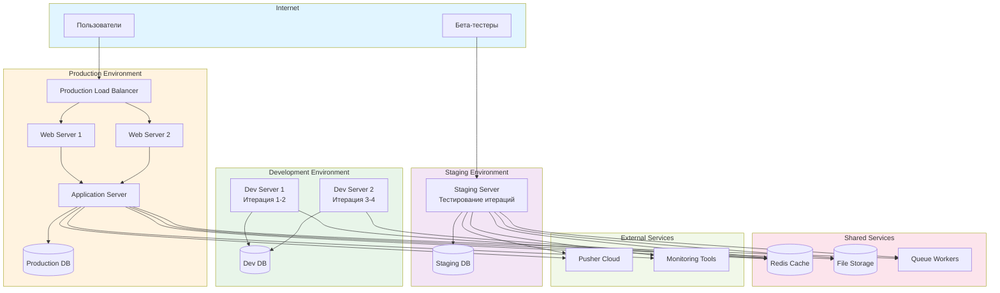

# Диаграмма развертывания - Spiral модель

## Описание

Диаграмма показывает физическую архитектуру развертывания системы Library Stroll в спиральной модели. Развертывание происходит поэтапно по мере завершения итераций.

## Диаграмма (Mermaid)

## Особенности развертывания в Spiral

- **Поэтапное развертывание** — каждая итерация развертывается отдельно
- **Множественные окружения** — Development, Staging, Production
- **Раннее тестирование** — Staging для тестирования перед Production
- **Постепенный рост** — инфраструктура расширяется по мере необходимости

