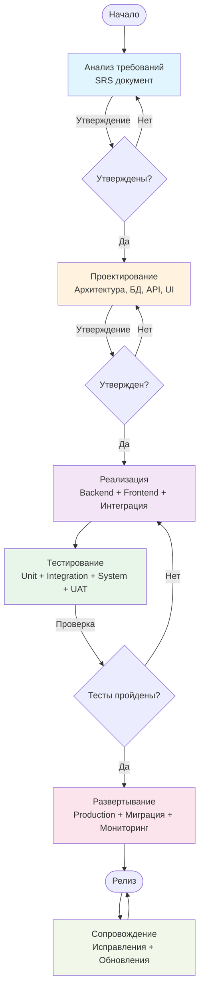

# Диаграмма активностей - Waterfall модель

## Описание

Диаграмма показывает последовательный поток процессов в каскадной модели для проекта Library Stroll.

## Диаграмма (Mermaid)

## Легенда

- **Синий блок (Анализ требований):** Сбор и документирование требований
- **Оранжевый блок (Проектирование):** Архитектурное и детальное проектирование
- **Фиолетовый блок (Реализация):** Разработка кода
- **Зеленый блок (Тестирование):** Все виды тестирования
- **Розовый блок (Развертывание):** Подготовка и запуск в production
- **Светло-зеленый блок (Сопровождение):** Поддержка и обновления

## Ключевые точки принятия решений

1. **Утверждение требований** — если требования не утверждены, возврат к анализу
2. **Утверждение дизайна** — если дизайн не утвержден, возврат к проектированию
3. **Тесты пройдены** — если тесты не пройдены, возврат к реализации

## Особенности Waterfall

- Строгая последовательность этапов
- Возврат к предыдущим этапам только при неудаче
- Документирование на каждом этапе
- Четкие точки принятия решений

