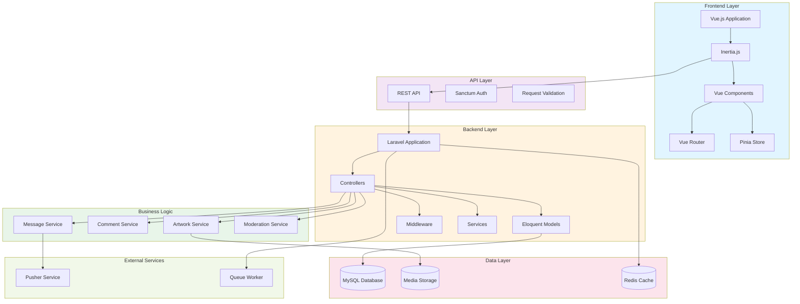

# Диаграмма компонентов - Waterfall модель

## Описание

Диаграмма показывает архитектуру компонентов системы Library Stroll в каскадной модели. Все компоненты разрабатываются последовательно и интегрируются на этапе реализации.

## Диаграмма (Mermaid)

## Описание компонентов

### Frontend Layer
- **Vue.js Application** — основное приложение
- **Inertia.js** — мост между Frontend и Backend
- **Vue Components** — переиспользуемые компоненты
- **Vue Router** — маршрутизация
- **Pinia Store** — управление состоянием

### Backend Layer
- **Laravel Application** — ядро приложения
- **Controllers** — обработка HTTP запросов
- **Eloquent Models** — ORM модели
- **Middleware** — промежуточное ПО (auth, CORS)
- **Services** — бизнес-логика

### API Layer
- **REST API** — RESTful endpoints
- **Sanctum Auth** — аутентификация
- **Request Validation** — валидация запросов

### Business Logic
- **Artwork Service** — управление работами
- **Comment Service** — управление комментариями
- **Message Service** — управление сообщениями
- **Moderation Service** — модерация контента

### Data Layer
- **MySQL Database** — основная БД
- **Media Storage** — файловое хранилище
- **Redis Cache** — кэширование

### External Services
- **Pusher Service** — real-time коммуникация
- **Queue Worker** — фоновые задачи

## Особенности архитектуры в Waterfall

- **Монолитная структура** — все компоненты разрабатываются вместе
- **Строгая иерархия** — четкое разделение слоев
- **Централизованная логика** — бизнес-логика в Services
- **Полная интеграция** — все компоненты интегрируются одновременно

