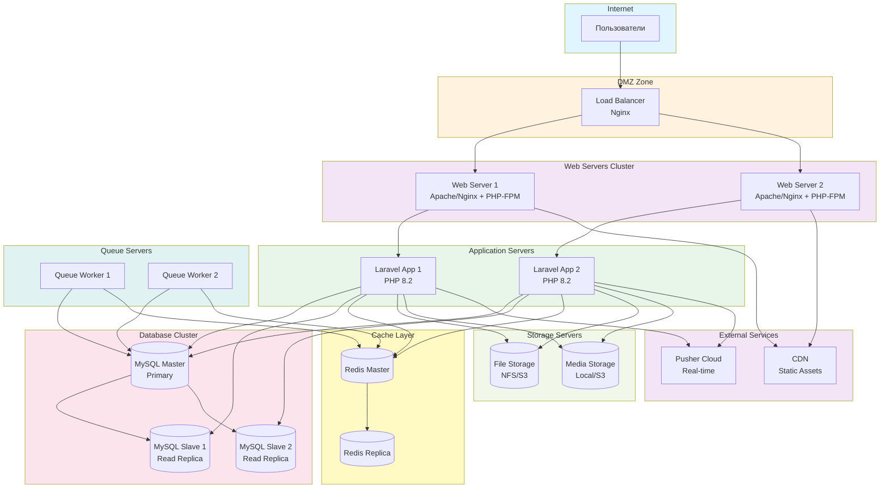

# Диаграмма развертывания - Waterfall модель

## Описание

Диаграмма показывает физическую архитектуру развертывания системы Library Stroll в каскадной модели. Все компоненты развертываются одновременно после завершения тестирования.

## Диаграмма (Mermaid)

## Описание узлов развертывания

### DMZ Zone
- **Load Balancer (Nginx)** — распределение нагрузки между веб-серверами

### Web Servers Cluster
- **Web Server 1, 2** — веб-серверы с PHP-FPM для обработки запросов

### Application Servers
- **Laravel App 1, 2** — экземпляры Laravel приложения

### Database Cluster
- **MySQL Master** — основная БД для записи
- **MySQL Slaves** — реплики для чтения (масштабирование)

### Storage Servers
- **File Storage** — хранилище файлов (NFS или S3)
- **Media Storage** — хранилище медиа-контента

### Cache Layer
- **Redis Master/Replica** — кэширование и сессии

### Queue Servers
- **Queue Workers** — обработка фоновых задач

### External Services
- **Pusher Cloud** — real-time коммуникация
- **CDN** — доставка статических ресурсов

## Особенности развертывания в Waterfall

- **Полное развертывание** — все компоненты развертываются одновременно
- **Масштабируемость** — горизонтальное масштабирование веб-серверов и БД
- **Высокая доступность** — репликация БД и Redis
- **Централизованное хранилище** — общее хранилище файлов для всех серверов

