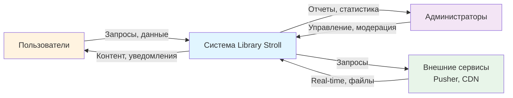

# DFD Уровень 0 - Контекстная диаграмма

## Описание

Контекстная диаграмма показывает систему Library Stroll как единый процесс с внешними сущностями.

## Диаграмма (Mermaid)

## Внешние сущности

1. **Пользователи** - художники и посетители платформы
2. **Администраторы** - модераторы и администраторы системы
3. **Внешние сервисы** - Pusher (real-time), CDN (файлы)

## Потоки данных

### От Пользователей к Системе:
- Запросы на регистрацию/вход
- Художественные работы (загрузка)
- Комментарии и сообщения
- Лайки и подписки

### От Системы к Пользователям:
- Отображение контента
- Уведомления
- Результаты операций

### От Администраторов к Системе:
- Команды модерации
- Настройки системы
- Управление пользователями

### От Системы к Администраторам:
- Отчеты о модерации
- Статистика системы
- Логи активности

