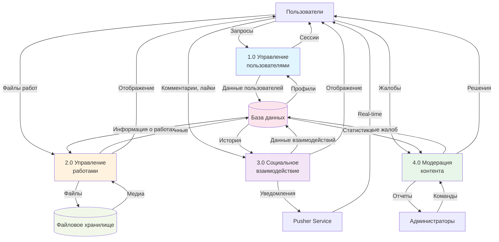

# DFD Уровень 1 - Декомпозиция системы

## Описание

DFD уровня 1 показывает основные процессы системы Library Stroll.

## Диаграмма (Mermaid)

## Процессы уровня 1

### 1.0 Управление пользователями
**Входы:** Запросы регистрации, входа, редактирования профиля  
**Выходы:** Сессии пользователей, профили  
**Хранилища данных:** База данных (таблицы users, user_preferences)

### 2.0 Управление работами
**Входы:** Файлы работ, метаданные, запросы на просмотр  
**Выходы:** Отображение работ, галереи  
**Хранилища данных:** База данных (artworks), Файловое хранилище (медиа)

### 3.0 Социальное взаимодействие
**Входы:** Комментарии, лайки, сообщения  
**Выходы:** Отображение взаимодействий, уведомления  
**Хранилища данных:** База данных (comments, likes, messages)  
**Внешние сущности:** Pusher (real-time уведомления)

### 4.0 Модерация контента
**Входы:** Жалобы от пользователей, команды от администраторов  
**Выходы:** Решения модерации, отчеты  
**Хранилища данных:** База данных (complaints, moderation_logs)

