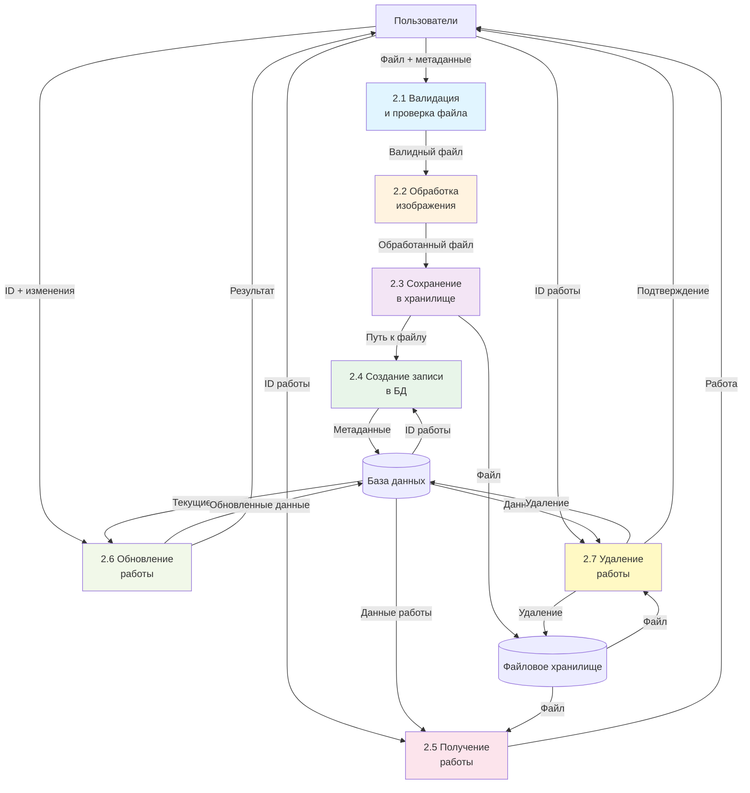

# DFD Уровень 2 - Элементарные процессы

## Описание

DFD уровня 2 показывает декомпозицию процесса "Управление работами" (2.0) до элементарных процессов.

## Диаграмма 2.0: Управление работами (детализация)

## Элементарные процессы

### 2.1 Валидация и проверка файла
**Описание:** Проверка типа файла, размера, формата  
**Входы:** Файл от пользователя  
**Выходы:** Валидный файл или ошибка  
**Тип:** Элементарный процесс

### 2.2 Обработка изображения
**Описание:** Изменение размера, создание миниатюр, оптимизация  
**Входы:** Валидный файл  
**Выходы:** Обработанный файл  
**Тип:** Элементарный процесс

### 2.3 Сохранение в хранилище
**Описание:** Сохранение файла в файловую систему или S3  
**Входы:** Обработанный файл  
**Выходы:** Путь к файлу  
**Тип:** Элементарный процесс

### 2.4 Создание записи в БД
**Описание:** Создание записи artwork в базе данных  
**Входы:** Метаданные, путь к файлу  
**Выходы:** ID созданной работы  
**Тип:** Элементарный процесс

### 2.5 Получение работы
**Описание:** Извлечение данных работы из БД и файла из хранилища  
**Входы:** ID работы  
**Выходы:** Полные данные работы  
**Тип:** Элементарный процесс

### 2.6 Обновление работы
**Описание:** Обновление метаданных работы в БД  
**Входы:** ID работы, изменения  
**Выходы:** Обновленные данные  
**Тип:** Элементарный процесс

### 2.7 Удаление работы
**Описание:** Удаление записи из БД и файла из хранилища  
**Входы:** ID работы  
**Выходы:** Подтверждение удаления  
**Тип:** Элементарный процесс

