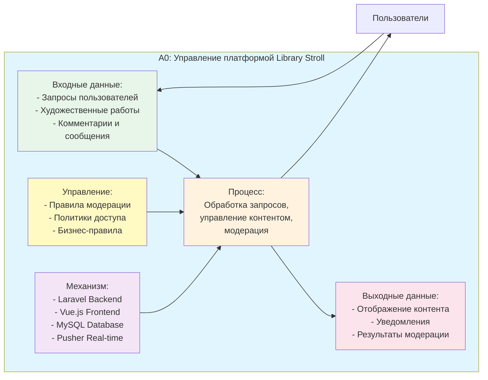

# SADT Диаграмма A0 - Верхний уровень

## Описание

Диаграмма A0 представляет систему Library Stroll на самом верхнем уровне абстракции.

## Диаграмма (Mermaid)

## Описание элементов

### Входные данные (Input)
- Запросы пользователей (регистрация, вход, просмотр контента)
- Художественные работы (загрузка, редактирование)
- Комментарии и сообщения (создание, ответы)

### Процесс (Process)
- Обработка запросов пользователей
- Управление контентом (публикация, редактирование, удаление)
- Модерация контента и пользователей

### Выходные данные (Output)
- Отображение контента пользователям
- Уведомления о событиях
- Результаты модерации

### Управление (Control)
- Правила модерации контента
- Политики доступа и приватности
- Бизнес-правила платформы

### Механизм (Mechanism)
- Laravel Backend (обработка запросов)
- Vue.js Frontend (отображение)
- MySQL Database (хранение данных)
- Pusher Real-time (коммуникация)

