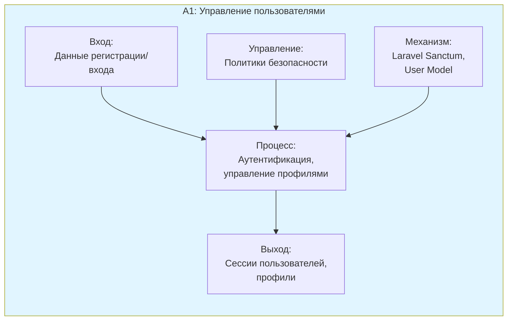
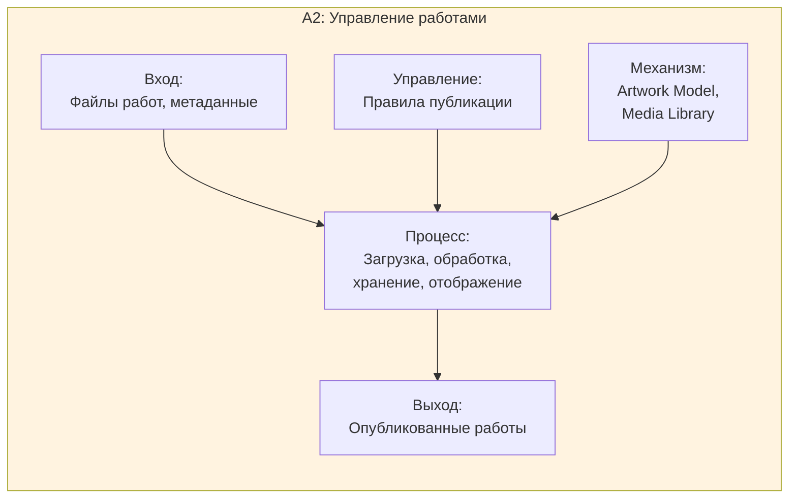
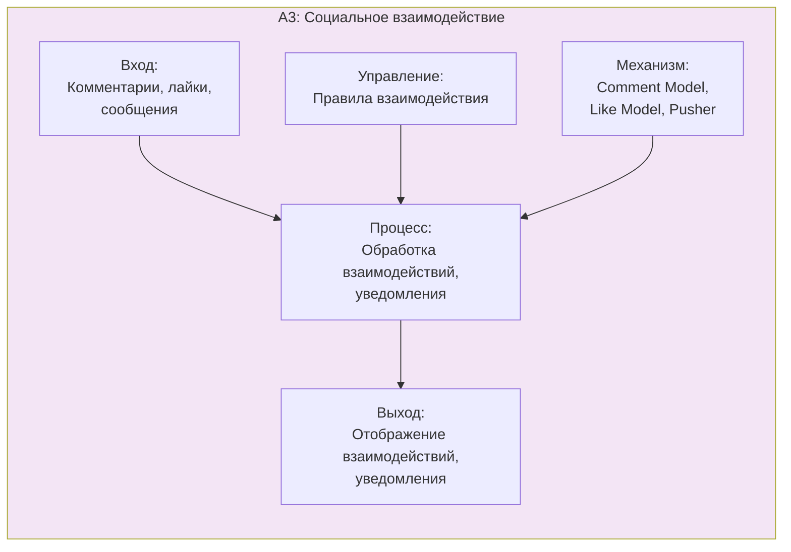
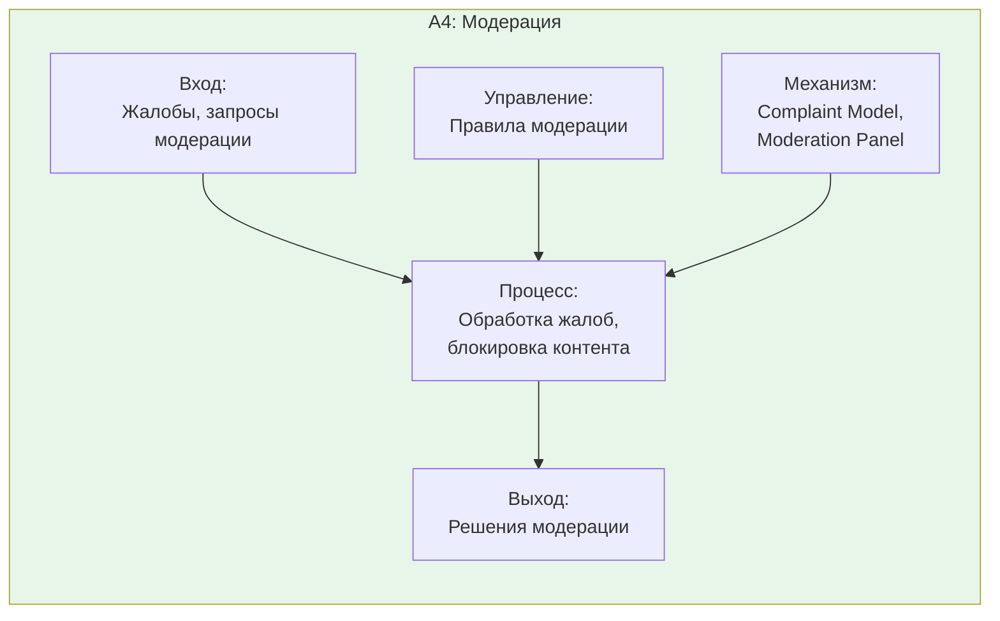

# SADT Диаграммы A1 - Декомпозиция A0

## Описание

Диаграммы A1 представляют декомпозицию верхнего уровня на основные функциональные области.

## Диаграмма A1: Управление пользователями и аутентификацией



## Диаграмма A2: Управление художественными работами



## Диаграмма A3: Социальное взаимодействие



## Диаграмма A4: Модерация и администрирование



## Иерархия декомпозиции

```
A0: Управление платформой Library Stroll
├── A1: Управление пользователями и аутентификацией
├── A2: Управление художественными работами
├── A3: Социальное взаимодействие
└── A4: Модерация и администрирование
```

