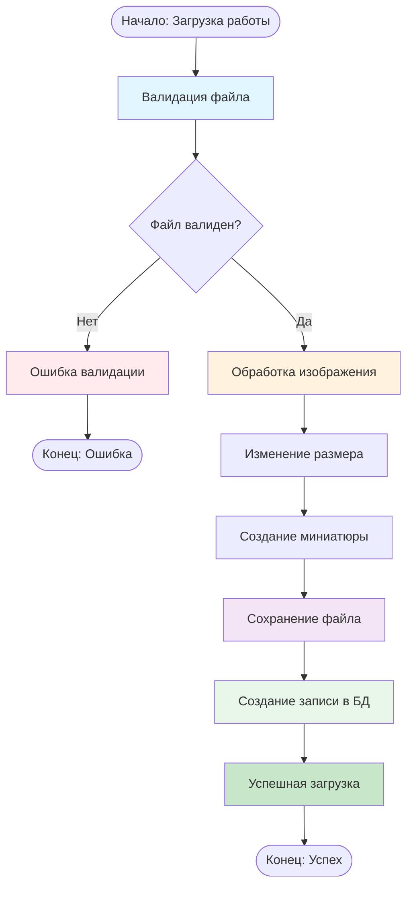
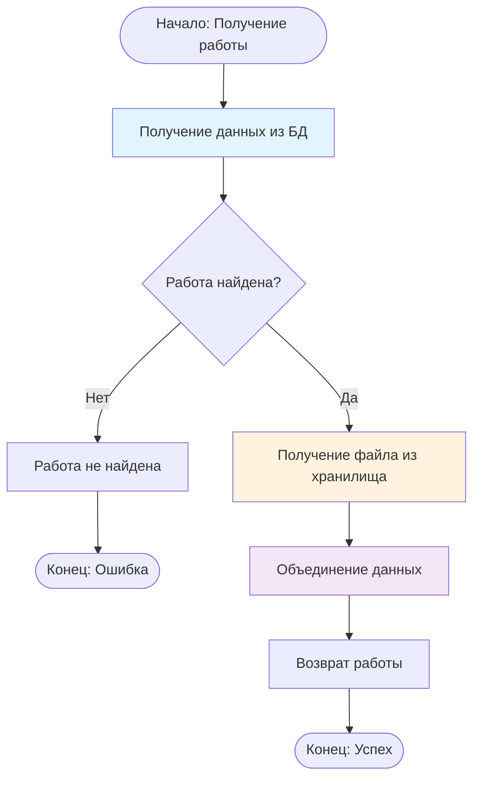
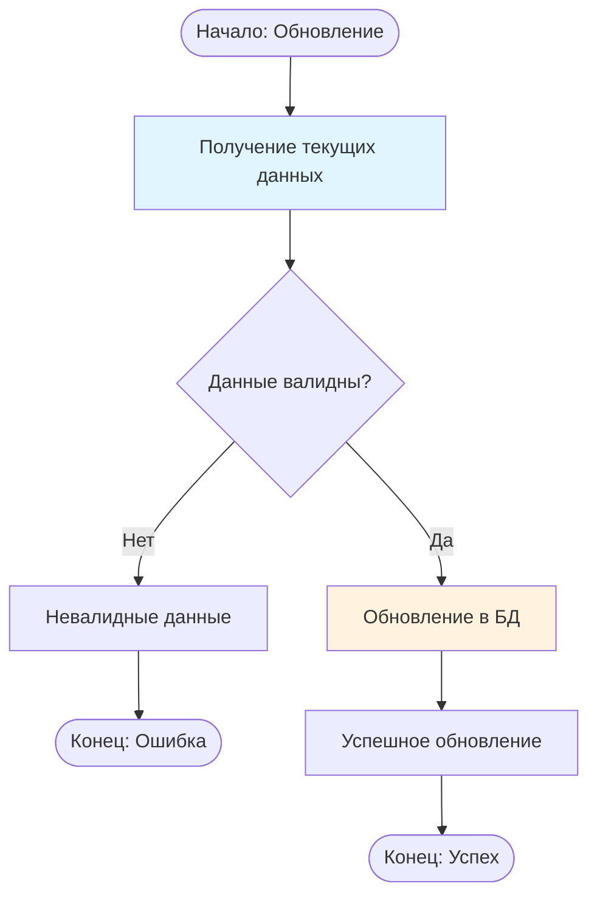
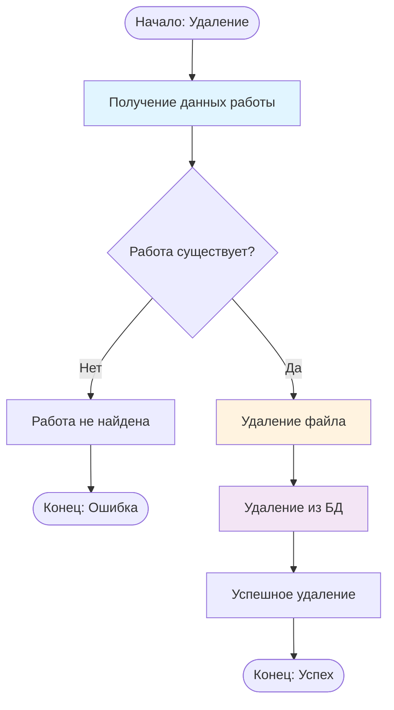

# UML Диаграммы активностей

## Описание

Диаграммы активностей, полученные трансформацией процессов DFD.

## Диаграмма активности: Загрузка работы

## Диаграмма активности: Получение работы

## Диаграмма активности: Обновление работы

## Диаграмма активности: Удаление работы

## Соответствие DFD процессам

- **Загрузка работы** соответствует процессам: 2.1 → 2.2 → 2.3 → 2.4
- **Получение работы** соответствует процессу: 2.5
- **Обновление работы** соответствует процессу: 2.6
- **Удаление работы** соответствует процессу: 2.7

