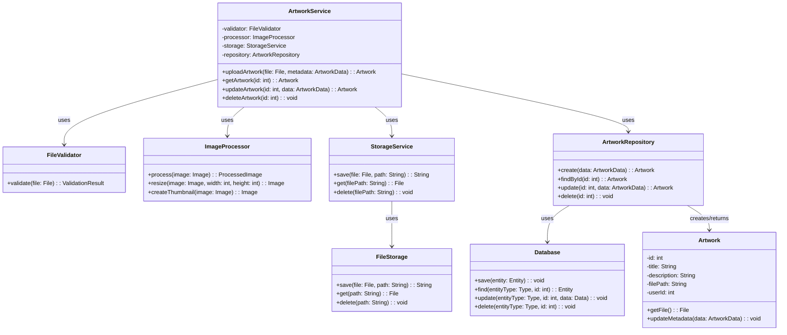

# UML Диаграмма классов

## Описание

Диаграмма классов, полученная трансформацией из DFD модели процесса "Управление работами".

## Диаграмма (Mermaid)

## Описание классов

### ArtworkService
Главный сервисный класс, координирующий все операции с работами. Соответствует процессу "2.0 Управление работами" из DFD.

### FileValidator
Класс для валидации файлов. Соответствует процессу "2.1 Валидация файла".

### ImageProcessor
Класс для обработки изображений. Соответствует процессу "2.2 Обработка изображения".

### StorageService
Сервис для работы с файловым хранилищем. Соответствует процессу "2.3 Сохранение в хранилище".

### ArtworkRepository
Репозиторий для работы с базой данных. Соответствует процессам "2.4 Создание записи", "2.5 Получение", "2.6 Обновление", "2.7 Удаление".

### Artwork
Модель данных работы. Соответствует хранилищу данных "База данных (artworks)".

### Database
Абстракция базы данных. Соответствует хранилищу данных "База данных".

### FileStorage
Абстракция файлового хранилища. Соответствует хранилищу данных "Файловое хранилище".

