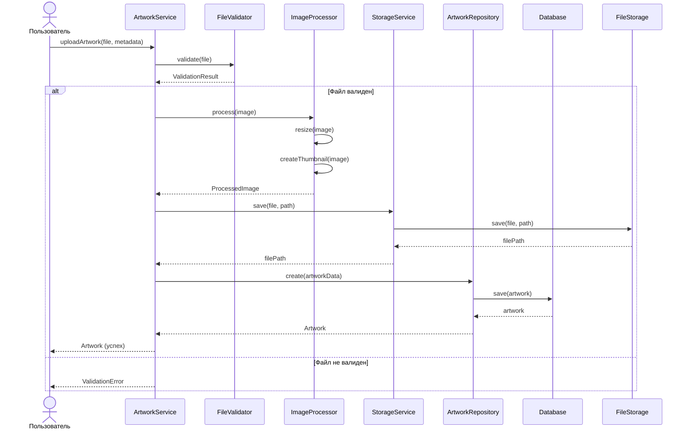
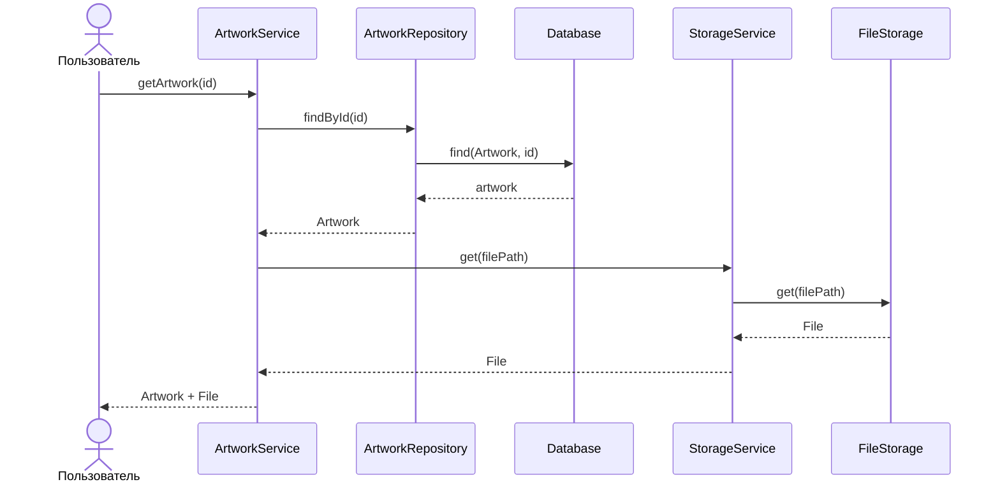
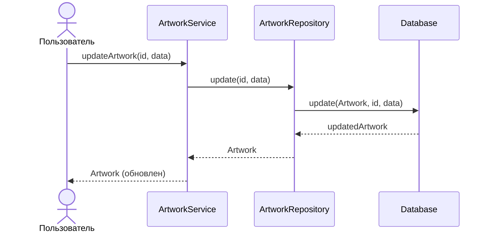
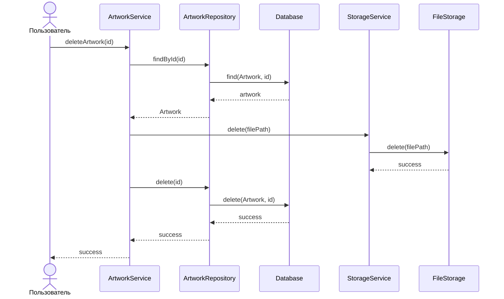

# UML Диаграммы последовательности

## Описание

Диаграммы последовательности, полученные трансформацией последовательностей процессов из DFD.

## Диаграмма последовательности: Загрузка работы

## Диаграмма последовательности: Получение работы

## Диаграмма последовательности: Обновление работы

## Диаграмма последовательности: Удаление работы

## Соответствие DFD процессам

- **Загрузка работы** соответствует последовательности: 2.1 → 2.2 → 2.3 → 2.4
- **Получение работы** соответствует процессу: 2.5
- **Обновление работы** соответствует процессу: 2.6
- **Удаление работы** соответствует процессу: 2.7

