# UML Диаграмма активности - Процесс интерпретации метаданных

## Описание

Диаграмма активности показывает процесс интерпретации метаданных и генерации конфигурации формы.

## Диаграмма (Mermaid)

```mermaid
flowchart TD
    Start([Запрос конфигурации формы]) --> CheckCache{Метаданные<br/>в кэше?}
    
    CheckCache -->|Да| GetFromCache[Получить из кэша]
    CheckCache -->|Нет| LoadEntity[Загрузить метаданные<br/>сущности из БД]
    
    LoadEntity --> LoadAttributes[Загрузить атрибуты<br/>из БД]
    LoadAttributes --> LoadRelationships[Загрузить связи<br/>из БД]
    LoadRelationships --> LoadForms[Загрузить формы<br/>из БД]
    LoadForms --> CacheMetadata[Сохранить в кэш]
    
    CacheMetadata --> FindForm[Найти нужную форму<br/>по имени]
    GetFromCache --> FindForm
    
    FindForm --> CheckForm{Форма<br/>найдена?}
    CheckForm -->|Нет| ErrorForm[Ошибка:<br/>Форма не найдена]
    CheckForm -->|Да| ProcessFields[Обработать поля<br/>формы]
    
    ProcessFields --> ProcessSection{Обработать<br/>секции?}
    ProcessSection -->|Да| BuildSections[Построить секции<br/>формы]
    ProcessSection -->|Нет| BuildFields[Построить поля<br/>формы]
    BuildSections --> BuildFields
    
    BuildFields --> CheckFieldType{Тип поля:<br/>Атрибут или<br/>Связь?}
    
    CheckFieldType -->|Атрибут| GetAttribute[Получить метаданные<br/>атрибута]
    CheckFieldType -->|Связь| GetRelationship[Получить метаданные<br/>связи]
    
    GetAttribute --> BuildAttributeField[Построить поле<br/>из атрибута]
    GetRelationship --> BuildRelationshipField[Построить поле<br/>из связи]
    
    BuildAttributeField --> AddField[Добавить поле<br/>в конфигурацию]
    BuildRelationshipField --> AddField
    
    AddField --> MoreFields{Есть еще<br/>поля?}
    MoreFields -->|Да| ProcessFields
    MoreFields -->|Нет| SortFields[Отсортировать поля<br/>по порядку]
    
    SortFields --> ValidateConfig[Валидировать<br/>конфигурацию]
    ValidateConfig --> ReturnConfig[Вернуть конфигурацию<br/>формы]
    
    ErrorForm --> End([Конец: Ошибка])
    ReturnConfig --> EndSuccess([Конец: Успех])
    
    style Start fill:#e1f5ff
    style LoadEntity fill:#fff3e0
    style ProcessFields fill:#f3e5f5
    style BuildFields fill:#e8f5e9
    style ReturnConfig fill:#c8e6c9
    style ErrorForm fill:#ffebee
```

## Описание процесса

### Этап 1: Загрузка метаданных
1. Проверка кэша метаданных
2. Если нет в кэше - загрузка из БД:
   - Загрузка метаданных сущности
   - Загрузка атрибутов
   - Загрузка связей
   - Загрузка форм
3. Сохранение в кэш

### Этап 2: Поиск формы
1. Поиск нужной формы по имени (create, edit, view)
2. Проверка существования формы

### Этап 3: Обработка полей
1. Обработка секций формы (если есть)
2. Для каждого поля:
   - Определение типа (атрибут или связь)
   - Получение метаданных
   - Построение конфигурации поля
   - Добавление в конфигурацию формы

### Этап 4: Финальная обработка
1. Сортировка полей по порядку
2. Валидация конфигурации
3. Возврат готовой конфигурации

## Особенности процесса

- **Кэширование:** Метаданные кэшируются для оптимизации
- **Динамическая генерация:** Конфигурация генерируется на основе метаданных из БД
- **Гибкость:** Поддержка как атрибутов, так и связей в формах
- **Валидация:** Проверка корректности конфигурации перед возвратом

