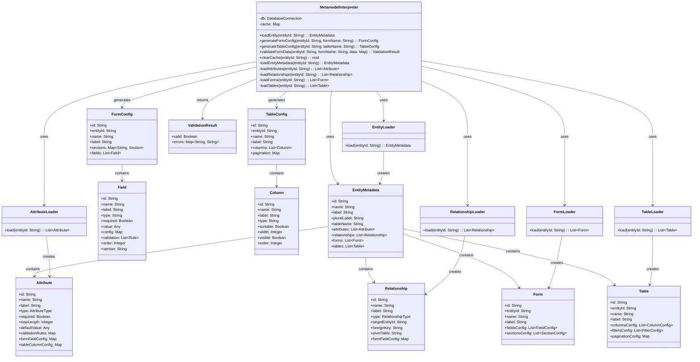

# UML Диаграмма классов - Метамодель системы

## Описание

Диаграмма классов показывает структуру метамодели системы управления метаданными.

## Диаграмма (Mermaid)

## Описание классов

### MetamodelInterpreter
Главный класс интерпретатора метамодели. Отвечает за загрузку метаданных из БД и генерацию конфигураций интерфейсов.

**Основные методы:**
- `loadEntity()` - загрузка полных метаданных сущности
- `generateFormConfig()` - генерация конфигурации формы
- `generateTableConfig()` - генерация конфигурации таблицы
- `validateFormData()` - валидация данных формы

### EntityMetadata
Представляет метаданные сущности (Entity).

**Атрибуты:**
- `id` - идентификатор сущности
- `name` - имя класса
- `label` - отображаемое имя
- `attributes` - список атрибутов
- `relationships` - список связей
- `forms` - список форм
- `tables` - список таблиц

### Attribute
Представляет метаданные атрибута.

**Атрибуты:**
- `type` - тип данных (string, integer, text и т.д.)
- `required` - обязательность заполнения
- `validationRules` - правила валидации
- `formFieldConfig` - конфигурация поля формы
- `tableColumnConfig` - конфигурация колонки таблицы

### Relationship
Представляет метаданные связи между сущностями.

**Атрибуты:**
- `type` - тип связи (belongsTo, hasMany и т.д.)
- `targetEntityId` - целевая сущность
- `foreignKey` - внешний ключ
- `pivotTable` - промежуточная таблица (для Many-to-Many)

### Form / Table
Представляют метаданные форм и таблиц соответственно.

### FormConfig / TableConfig
Конфигурации, генерируемые интерпретатором для использования во frontend.

### Loaders
Классы для загрузки метаданных из БД:
- `EntityLoader` - загрузка сущностей
- `AttributeLoader` - загрузка атрибутов
- `RelationshipLoader` - загрузка связей
- `FormLoader` - загрузка форм
- `TableLoader` - загрузка таблиц

