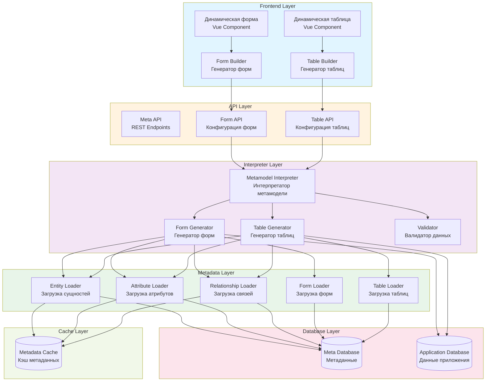

# UML Диаграмма компонентов - Система управления метаданными

## Описание

Диаграмма компонентов показывает архитектуру системы управления метаданными (DSM-подход).

## Диаграмма (Mermaid)

## Описание компонентов

### Frontend Layer
- **DynamicForm** - Vue компонент для динамического отображения форм
- **DynamicTable** - Vue компонент для динамического отображения таблиц
- **FormBuilder** - Генератор конфигурации форм на основе метаданных
- **TableBuilder** - Генератор конфигурации таблиц на основе метаданных

### API Layer
- **MetaAPI** - REST API для работы с метаданными
- **FormAPI** - API для получения конфигурации форм
- **TableAPI** - API для получения конфигурации таблиц

### Interpreter Layer
- **MetamodelInterpreter** - Главный интерпретатор метамодели
- **FormGenerator** - Генератор конфигурации форм
- **TableGenerator** - Генератор конфигурации таблиц
- **Validator** - Валидатор данных на основе метаданных

### Metadata Layer
- **EntityLoader** - Загрузка метаданных сущностей
- **AttributeLoader** - Загрузка метаданных атрибутов
- **RelationshipLoader** - Загрузка метаданных связей
- **FormLoader** - Загрузка метаданных форм
- **TableLoader** - Загрузка метаданных таблиц

### Database Layer
- **Meta Database** - База данных метаданных (meta_entities, meta_attributes и т.д.)
- **Application Database** - База данных приложения (artworks, users и т.д.)

### Cache Layer
- **Metadata Cache** - Кэш метаданных для быстрого доступа

## Особенности архитектуры

- **Динамическая генерация:** Интерфейсы генерируются на основе метаданных из БД
- **Без перекомпиляции:** Изменение метаданных в БД сразу отражается в интерфейсе
- **Кэширование:** Метаданные кэшируются для оптимизации производительности
- **Разделение слоев:** Четкое разделение между метаданными и данными приложения

