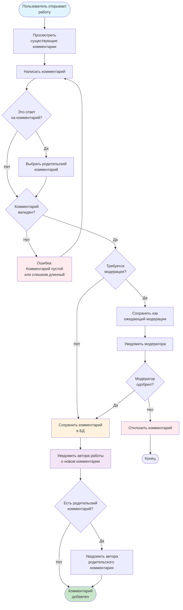

# Activity диаграмма - Процесс комментирования

## Описание

Диаграмма активности показывает бизнес-процесс добавления комментария к работе.

## Диаграмма (Mermaid)

## Описание процесса

### Этап 1: Просмотр и написание
1. Просмотр существующих комментариев
2. Написание нового комментария
3. Определение, является ли комментарий ответом

### Этап 2: Валидация
1. Проверка валидности комментария (не пустой, не слишком длинный)
2. Проверка необходимости модерации

### Этап 3: Сохранение
1. Сохранение комментария в БД
2. Если требуется модерация - сохранение как ожидающий одобрения

### Этап 4: Уведомления
1. Уведомление автора работы о новом комментарии
2. Если это ответ - уведомление автора родительского комментария

## Альтернативные потоки

- **Невалидный комментарий** → возврат к написанию
- **Требуется модерация** → ожидание одобрения модератором
- **Комментарий отклонен** → уведомление пользователя об отклонении

