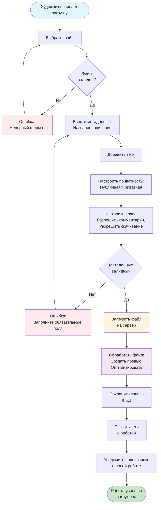

# Activity диаграмма - Загрузка работы

## Описание

Диаграмма активности показывает бизнес-процесс загрузки художественной работы художником.

## Диаграмма (Mermaid)

## Описание процесса

### Этап 1: Подготовка файла
1. Выбор файла (изображение, видео, GIF)
2. Валидация формата и размера файла

### Этап 2: Ввод метаданных
1. Ввод названия работы
2. Ввод описания (опционально)
3. Добавление тегов для категоризации
4. Настройка приватности (публичная/приватная)
5. Настройка прав (комментарии, скачивание)

### Этап 3: Загрузка и обработка
1. Загрузка файла на сервер
2. Обработка файла (создание превью, оптимизация)
3. Сохранение метаданных в БД
4. Связывание тегов с работой

### Этап 4: Уведомления
1. Уведомление подписчиков о новой работе

## Альтернативные потоки

- **Неверный формат файла** → возврат к выбору файла
- **Невалидные метаданные** → возврат к вводу метаданных
- **Ошибка загрузки** → отображение ошибки пользователю

