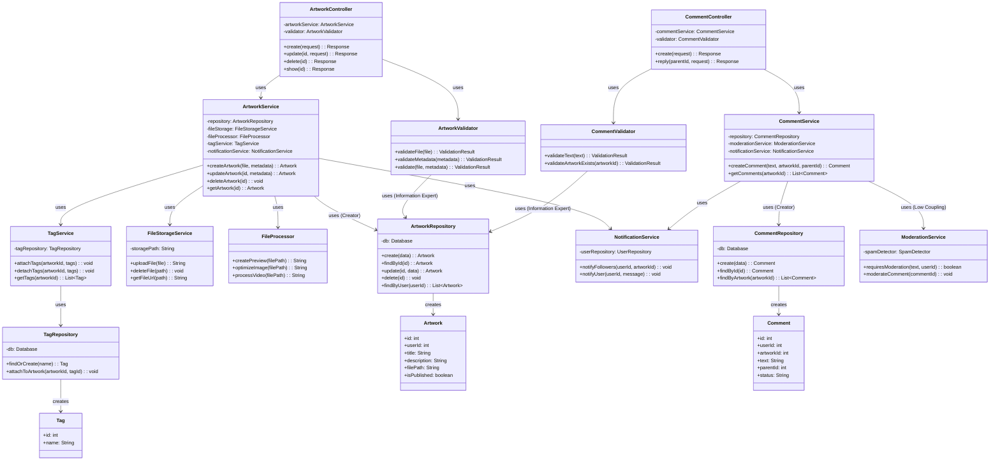

# Class диаграмма - Логическая структура системы

## Описание

Диаграмма классов показывает логическую структуру системы Library Stroll с применением GRASP шаблонов.

## Диаграмма (Mermaid)

## GRASP шаблоны в диаграмме

### 1. Controller (ArtworkController, CommentController)
- **Ответственность:** Обработка HTTP запросов и координация работы сервисов
- **Применение:** Контроллеры обрабатывают запросы и делегируют работу сервисам

### 2. Creator (ArtworkRepository, CommentRepository)
- **Ответственность:** Создание объектов Artwork и Comment
- **Применение:** Репозитории создают объекты, так как имеют всю информацию для их создания

### 3. Information Expert (ArtworkValidator, CommentValidator)
- **Ответственность:** Валидация данных на основе знаний о структуре данных
- **Применение:** Валидаторы знают правила валидации и структуру данных

### 4. Low Coupling (ModerationService)
- **Ответственность:** Минимизация зависимостей между классами
- **Применение:** ModerationService изолирован от основной бизнес-логики

### 5. High Cohesion (NotificationService, TagService)
- **Ответственность:** Высокая связность внутри класса
- **Применение:** Каждый сервис отвечает за одну область функциональности

