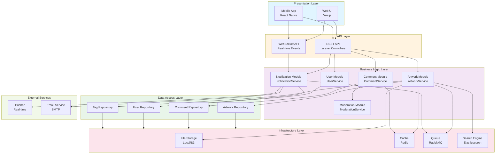

# Component диаграмма - Архитектура реализации

## Описание

Диаграмма компонентов показывает архитектуру системы Library Stroll на уровне компонентов.

## Диаграмма (Mermaid)

## Описание компонентов

### Presentation Layer
- **Web UI** - веб-интерфейс на Vue.js
- **Mobile App** - мобильное приложение на React Native

### API Layer
- **REST API** - RESTful API для синхронных запросов
- **WebSocket API** - WebSocket для real-time событий

### Business Logic Layer
- **Artwork Module** - бизнес-логика работы с работами
- **Comment Module** - бизнес-логика комментариев
- **User Module** - бизнес-логика пользователей
- **Notification Module** - бизнес-логика уведомлений
- **Moderation Module** - бизнес-логика модерации

### Data Access Layer
- **Repositories** - абстракция доступа к данным (GRASP: Creator)

### Infrastructure Layer
- **File Storage** - хранение файлов (локальное или S3)
- **Cache** - кэширование данных (Redis)
- **Queue** - асинхронная обработка задач
- **Search Engine** - полнотекстовый поиск

### External Services
- **Pusher** - сервис real-time уведомлений
- **Email Service** - отправка email

## Принципы проектирования

- **Separation of Concerns** - разделение ответственности по слоям
- **Dependency Inversion** - зависимости направлены к абстракциям
- **Interface Segregation** - модули зависят только от нужных интерфейсов

