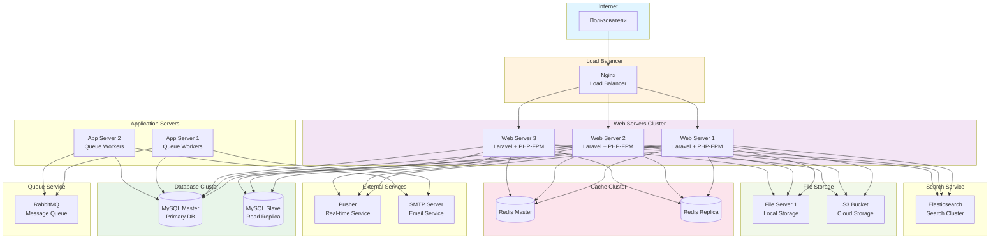

# Deployment диаграмма - Развертывание системы

## Описание

Диаграмма развертывания показывает физическую архитектуру развертывания системы Library Stroll.

## Диаграмма (Mermaid)

## Описание узлов развертывания

### Load Balancer
- **Nginx** - балансировщик нагрузки, распределяет запросы между web-серверами

### Web Servers Cluster
- **3 Web Server** - серверы приложений Laravel с PHP-FPM
- Обрабатывают HTTP запросы
- Используют read replicas для чтения данных

### Application Servers
- **2 App Server** - серверы для обработки фоновых задач (queue workers)
- Обрабатывают асинхронные задачи (отправка email, обработка файлов)

### Database Cluster
- **MySQL Master** - основная база данных для записи
- **MySQL Slave** - реплика для чтения (масштабирование чтения)

### Cache Cluster
- **Redis Master** - основной кэш-сервер
- **Redis Replica** - реплика для отказоустойчивости

### File Storage
- **File Server** - локальное хранилище файлов
- **S3 Bucket** - облачное хранилище для резервного копирования

### Search Service
- **Elasticsearch** - кластер поискового движка для полнотекстового поиска

### Queue Service
- **RabbitMQ** - очередь сообщений для асинхронной обработки

### External Services
- **Pusher** - сервис real-time уведомлений
- **SMTP Server** - сервер отправки email

## Масштабирование

- **Горизонтальное масштабирование** - добавление web-серверов
- **Вертикальное масштабирование** - увеличение ресурсов серверов
- **Read Replicas** - масштабирование чтения из БД
- **Cache Replication** - репликация кэша для отказоустойчивости

