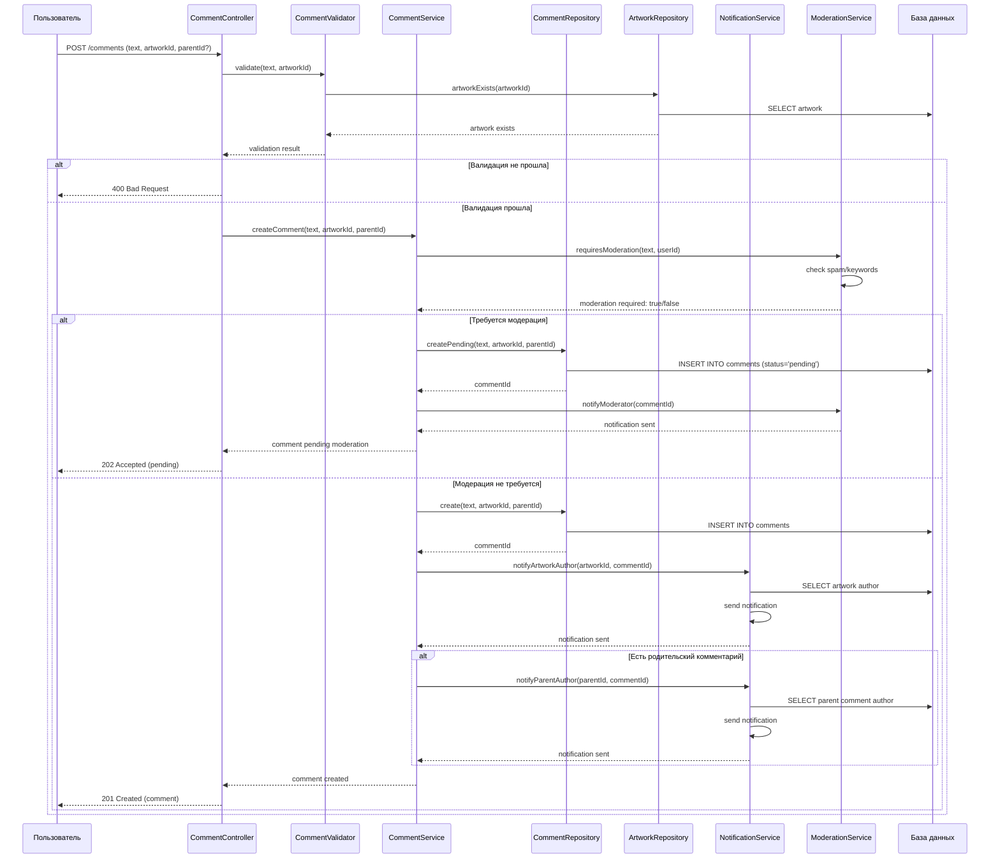

# Sequence диаграмма - Добавление комментария

## Описание

Диаграмма последовательности показывает взаимодействие объектов при добавлении комментария к работе.

## Диаграмма (Mermaid)

## Описание взаимодействия

### Участники

1. **Пользователь** - пользователь, добавляющий комментарий
2. **CommentController** - контроллер для обработки запросов
3. **CommentValidator** - валидатор комментариев (GRASP: Information Expert)
4. **CommentService** - сервис бизнес-логики (GRASP: Controller)
5. **CommentRepository** - репозиторий для работы с комментариями (GRASP: Creator)
6. **ArtworkRepository** - репозиторий для проверки существования работы
7. **ModerationService** - сервис модерации (GRASP: Low Coupling)
8. **NotificationService** - сервис уведомлений (GRASP: High Cohesion)
9. **База данных** - хранилище данных

### Основной поток

1. **Валидация** - проверка текста и существования работы
2. **Проверка модерации** - определение необходимости модерации
3. **Сохранение комментария** - создание записи в БД
4. **Уведомления** - уведомление автора работы и автора родительского комментария (если есть)

### Альтернативные потоки

- **Требуется модерация** → сохранение как ожидающий одобрения
- **Ошибка валидации** → возврат ошибки клиенту

