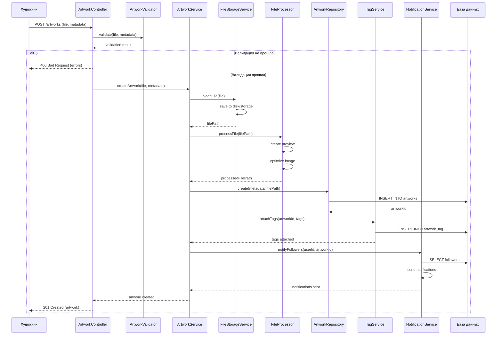

# Sequence диаграмма - Загрузка работы

## Описание

Диаграмма последовательности показывает взаимодействие объектов при загрузке художественной работы.

## Диаграмма (Mermaid)

## Описание взаимодействия

### Участники

1. **Художник** - пользователь, загружающий работу
2. **ArtworkController** - контроллер, обрабатывающий HTTP запрос
3. **ArtworkValidator** - валидатор данных (GRASP: Information Expert)
4. **ArtworkService** - сервис бизнес-логики (GRASP: Controller)
5. **FileStorageService** - сервис хранения файлов
6. **FileProcessor** - обработчик файлов (создание превью, оптимизация)
7. **ArtworkRepository** - репозиторий для работы с БД (GRASP: Creator)
8. **TagService** - сервис для работы с тегами
9. **NotificationService** - сервис уведомлений
10. **База данных** - хранилище данных

### Основной поток

1. **Валидация** - проверка файла и метаданных
2. **Загрузка файла** - сохранение файла в хранилище
3. **Обработка файла** - создание превью и оптимизация
4. **Сохранение в БД** - создание записи о работе
5. **Связывание тегов** - добавление тегов к работе
6. **Уведомления** - уведомление подписчиков

### Альтернативные потоки

- **Ошибка валидации** → возврат ошибки клиенту
- **Ошибка загрузки** → откат транзакции

