# Use Case диаграмма - Library Stroll

## Описание

Use Case диаграмма показывает функциональные требования системы Library Stroll с точки зрения пользователей.

## Диаграмма (Mermaid)

```mermaid
graph TB
    subgraph Actors["Актеры"]
        Artist[Художник]
        Viewer[Зритель]
        Moderator[Модератор]
        Admin[Администратор]
    end
    
    subgraph UC["Use Cases - Управление работами"]
        UC1[Загрузить работу]
        UC2[Редактировать работу]
        UC3[Удалить работу]
        UC4[Просмотреть работу]
        UC5[Поиск работ]
    end
    
    subgraph UC2_Group["Use Cases - Социальные функции"]
        UC6[Оставить комментарий]
        UC7[Поставить лайк]
        UC8[Ответить на комментарий]
        UC9[Просмотреть комментарии]
    end
    
    subgraph UC3_Group["Use Cases - Коллекции и теги"]
        UC10[Создать коллекцию]
        UC11[Добавить работу в коллекцию]
        UC12[Добавить теги]
        UC13[Просмотреть коллекции]
    end
    
    subgraph UC4_Group["Use Cases - Мессенджер"]
        UC14[Создать беседу]
        UC15[Отправить сообщение]
        UC16[Просмотреть сообщения]
        UC17[Прикрепить работу к сообщению]
    end
    
    subgraph UC5_Group["Use Cases - Модерация"]
        UC18[Подать жалобу]
        UC19[Просмотреть жалобы]
        UC20[Одобрить жалобу]
        UC21[Отклонить жалобу]
        UC22[Заблокировать контент]
    end
    
    Artist --> UC1
    Artist --> UC2
    Artist --> UC3
    Artist --> UC4
    Artist --> UC5
    Artist --> UC6
    Artist --> UC7
    Artist --> UC8
    Artist --> UC9
    Artist --> UC10
    Artist --> UC11
    Artist --> UC12
    Artist --> UC13
    Artist --> UC14
    Artist --> UC15
    Artist --> UC16
    Artist --> UC17
    Artist --> UC18
    
    Viewer --> UC4
    Viewer --> UC5
    Viewer --> UC6
    Viewer --> UC7
    Viewer --> UC9
    Viewer --> UC13
    Viewer --> UC18
    
    Moderator --> UC19
    Moderator --> UC20
    Moderator --> UC21
    Moderator --> UC22
    
    Admin --> UC19
    Admin --> UC20
    Admin --> UC21
    Admin --> UC22
    
    style Artist fill:#4a90e2,color:#fff
    style Viewer fill:#50c878,color:#fff
    style Moderator fill:#ff6b6b,color:#fff
    style Admin fill:#9b59b6,color:#fff
```

## Описание Use Cases

### Управление работами

1. **Загрузить работу** - Художник загружает новую работу (изображение, видео, GIF)
2. **Редактировать работу** - Художник изменяет метаданные работы
3. **Удалить работу** - Художник удаляет свою работу
4. **Просмотреть работу** - Просмотр работы с деталями
5. **Поиск работ** - Поиск работ по тегам, названию, автору

### Социальные функции

6. **Оставить комментарий** - Добавление комментария к работе
7. **Поставить лайк** - Оценка работы лайком
8. **Ответить на комментарий** - Создание вложенного комментария
9. **Просмотреть комментарии** - Просмотр всех комментариев к работе

### Коллекции и теги

10. **Создать коллекцию** - Создание новой коллекции работ
11. **Добавить работу в коллекцию** - Добавление работы в коллекцию
12. **Добавить теги** - Добавление тегов к работе
13. **Просмотреть коллекции** - Просмотр коллекций пользователя

### Мессенджер

14. **Создать беседу** - Создание диалога или группы
15. **Отправить сообщение** - Отправка сообщения в беседу
16. **Просмотреть сообщения** - Просмотр истории сообщений
17. **Прикрепить работу к сообщению** - Прикрепление работы к сообщению

### Модерация

18. **Подать жалобу** - Подача жалобы на контент
19. **Просмотреть жалобы** - Просмотр списка жалоб (модератор/админ)
20. **Одобрить жалобу** - Одобрение жалобы и блокировка контента
21. **Отклонить жалобу** - Отклонение жалобы
22. **Заблокировать контент** - Блокировка контента администратором

## Актеры

- **Художник** - пользователь, который публикует работы
- **Зритель** - пользователь, который просматривает контент
- **Модератор** - пользователь с правами модерации
- **Администратор** - пользователь с полными правами

